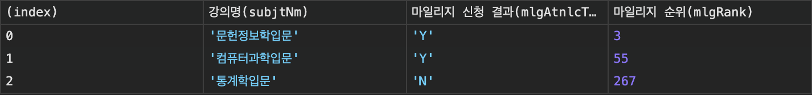

# yonsei-mileage-preview

스크립트를 크롬 확장 프로그램을 통해 주입해 마일리지 수강 신청 결과를 조회합니다.

- 수강 신청 결과는 `F12` 단축키를 통해 열 수 있는 개발자 도구의 콘솔에서 확인할 수 있습니다.
- URL 패턴이 `https://underwood1.yonsei.ac.kr/*`과 매칭될 때만 스크립트가 동작합니다.

## Sample Image



## 주입되는 스크립트 ([injected.js](injected.js))

```js
(function () {
  const MILEAGE_RESOURCE = "findMileStdList";
  const COURESE_NAME_KEY = "subjtNm";
  const MILEAGE_RESULT_KEY = "mlgAtnlcTrgetYn";
  const MILEAGE_RANK_KEY = "mlgRank";
  const KEY_MAP = {
    [COURESE_NAME_KEY]: `강의명(${COURESE_NAME_KEY})`,
    [MILEAGE_RESULT_KEY]: `마일리지 신청 결과(${MILEAGE_RESULT_KEY})`,
    [MILEAGE_RANK_KEY]: `마일리지 순위(${MILEAGE_RANK_KEY})`,
  };
  let fetched = false;

  function processResponse(responseText) {
    const response = JSON.parse(responseText);
    const mileageResults = Object.values(response)[0];
    return mileageResults.map((result) =>
      Object.entries(result).reduce((acc, [key, val]) => ({
        ...acc,
        [KEY_MAP[key] ?? key]: val,
      }))
    );
  }

  const originalOpen = XMLHttpRequest.prototype.open;
  XMLHttpRequest.prototype.open = function (method, url, ...args) {
    this.addEventListener("load", function () {
      if (url.includes(MILEAGE_RESOURCE) && !fetched) {
        const mileageResults = processResponse(this.responseText);
        console.table(mileageResults, [
          KEY_MAP[COURESE_NAME_KEY],
          KEY_MAP[MILEAGE_RESULT_KEY],
          KEY_MAP[MILEAGE_RANK_KEY],
        ]);
        fetched = true;
      }
    });
    originalOpen.apply(this, [method, url, ...args]);
  };
})();
```
